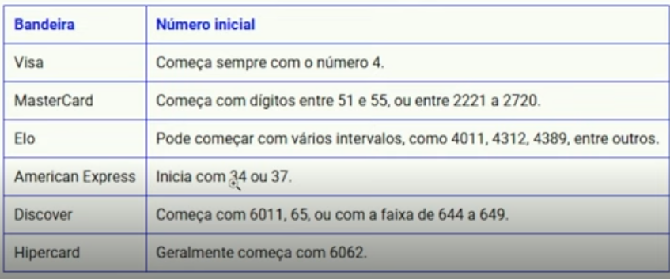

# Credit Card Validator

> Valide números de cartões de crédito de forma simples e rápida!

## ✨ Funcionalidades

- Validação de números de cartões de crédito utilizando o algoritmo de Luhn
- Identificação da bandeira do cartão (Visa, MasterCard, Amex, etc.)
- Interface intuitiva e responsiva
- Feedback visual imediato sobre a validade do cartão
- Suporte a múltiplas bandeiras (Visa, MasterCard, Amex, Hipercard, etc.)

## 🛠️ Tecnologias Utilizadas

- **HTML5**
- **CSS3**
- **JavaScript (ES6+)**
- Imagens das bandeiras em formato PNG

## 🚀 Como Rodar o Projeto

1. Clone este repositório:
   ```bash
   git clone https://github.com/OctavioDias/credit-card-validator.git
   ```
2. Acesse a pasta do projeto:
   ```bash
   cd credit-card-validator
   ```
3. Abra o arquivo `src/index.html` no seu navegador preferido.

> Não é necessário instalar dependências ou rodar servidores! O projeto é totalmente front-end.

## 📁 Estrutura de Pastas

```
credit-card-validator/
├── assets/         # Imagens das bandeiras dos cartões
├── src/
│   ├── index.html  # Página principal
│   └── index.js    # Lógica de validação e identificação
└── README.md
```

## 📸 Demonstração



## 🤝 Contribuição

Contribuições são bem-vindas! Sinta-se à vontade para abrir issues ou enviar pull requests.

## 📄 Licença

Este projeto está sob a licença MIT.


